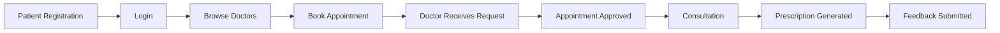
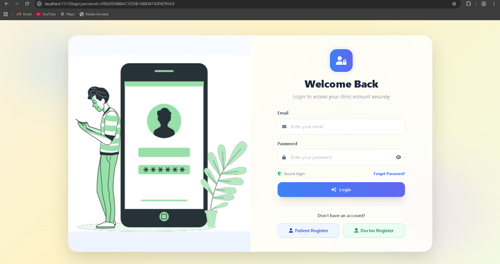
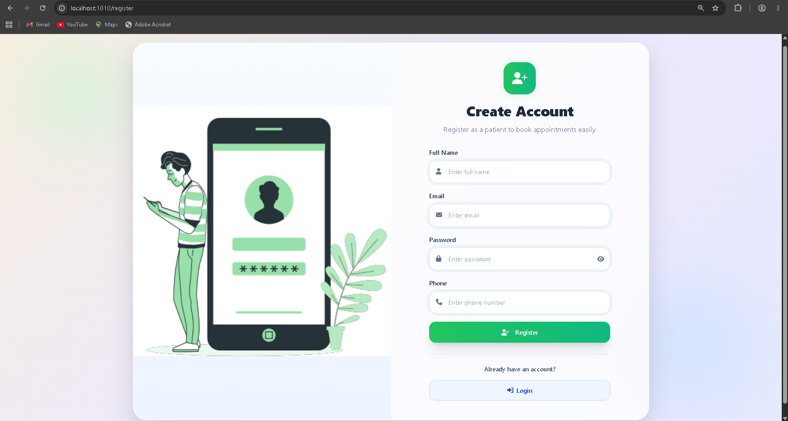
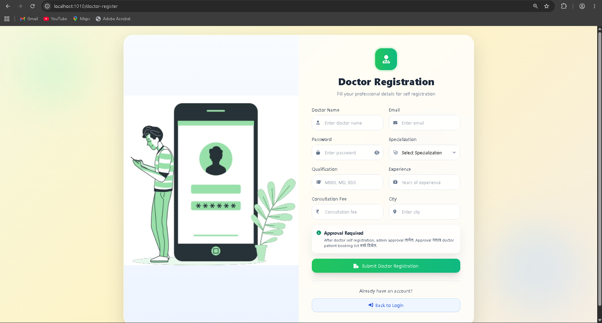
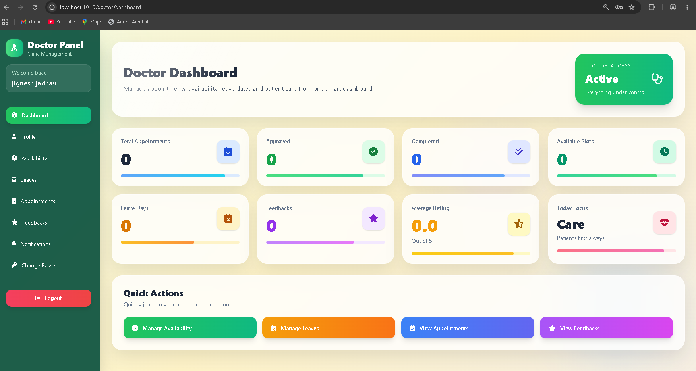
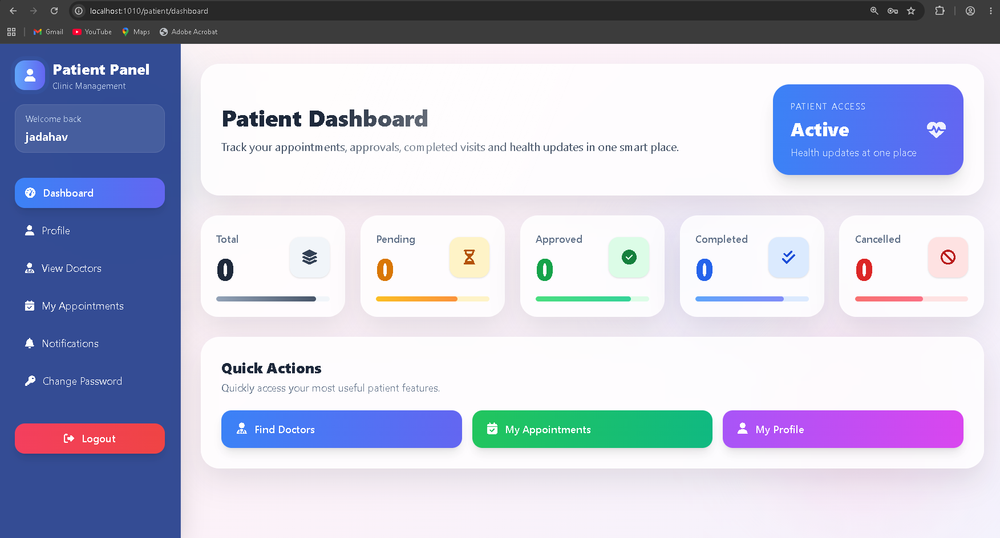
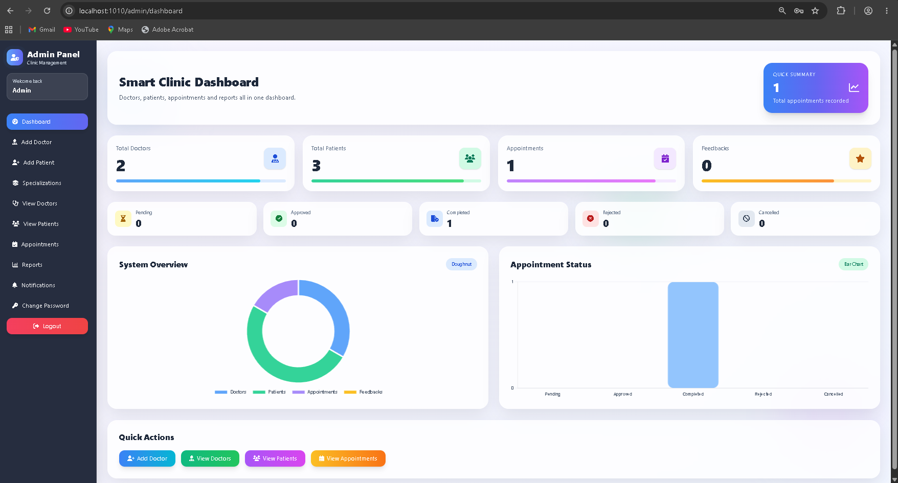

<div align="center">

# 🏥 Smart Clinic Management System


<br>


</div>

---

# 📖 About The Project

The **Smart Clinic Management System** is a full-stack healthcare management application developed using **Spring Boot**, **JSP**, **PostgreSQL**, and **Maven**.

The system is designed to automate clinic operations and provide seamless interaction between:

✔️ Admin

✔️ Doctors

✔️ Patients

It simplifies appointment scheduling, prescription management, doctor availability tracking, feedback collection, notifications, and report generation.

---

# 🚀 Key Features

## 👨‍💼 Admin Module

- Admin Dashboard
- Manage Doctors
- Manage Patients
- Manage Appointments
- Doctor Approval System
- Generate Reports
- Export PDF Reports
- Export CSV Reports
- Monitor Clinic Activities

---

## 👨‍⚕️ Doctor Module

- Doctor Registration
- Profile Management
- Appointment Management
- Prescription Creation
- Manage Availability
- Leave Management
- View Patient Feedback
- Notification Management

---

## 🧑‍🤝‍🧑 Patient Module

- Patient Registration
- Login System
- Browse Doctors
- Book Appointment
- Reschedule Appointment
- Cancel Appointment
- View Prescriptions
- Submit Feedback
- Receive Notifications

---

## 🔔 Notification System

- Appointment Notifications
- Doctor Notifications
- Patient Notifications
- Notification Tracking

---

## 🔐 Authentication System

- Secure Login
- Registration
- Forgot Password
- Password Reset
- Change Password

---

# 🏗️ System Architecture

```text
                       ┌──────────────────┐
                       │      Admin       │
                       └────────┬─────────┘
                                │
                                ▼

┌───────────────┐      ┌──────────────────┐      ┌───────────────┐
│    Patient    │─────▶│ Spring Boot MVC  │◀─────│    Doctor     │
└───────────────┘      └────────┬─────────┘      └───────────────┘
                                │
                                ▼

                      ┌─────────────────────┐
                      │    PostgreSQL DB    │
                      └─────────────────────┘
```

---

# 🛠️ Tech Stack

| Technology | Purpose |
|------------|----------|
| Java 21 | Backend Development |
| Spring Boot | Application Framework |
| Spring MVC | MVC Architecture |
| Spring Data JPA | ORM |
| PostgreSQL | Database |
| JSP | Frontend Views |
| JSTL | Dynamic JSP Pages |
| Maven | Build Tool |
| PDFBox | PDF Report Generation |
| Java Mail Sender | Email Services |
| Lombok | Boilerplate Reduction |

---

# 📂 Project Structure

```text
Smart-Clinic-Management-System
│
├── src
│   ├── main
│   │   ├── java
│   │   │   └── com.jignesh
│   │   │
│   │   ├── controller
│   │   │   ├── AuthController
│   │   │   ├── AdminController
│   │   │   ├── DoctorController
│   │   │   ├── PatientController
│   │   │   ├── NotificationController
│   │   │   └── ChangePasswordController
│   │   │
│   │   ├── service
│   │   │
│   │   ├── repository
│   │   │
│   │   ├── entity
│   │   │
│   │   └── config
│   │
│   ├── resources
│   │
│   └── webapp
│       └── WEB-INF
│           └── views
│
└── pom.xml
```

---

# 🗄️ Database Entities

```text
User
Doctor
Patient
Appointment
AppointmentHistory
DoctorAvailability
DoctorLeave
Prescription
Feedback
NotificationLog
PasswordResetToken
Specialization
```

---

# 🔄 Workflow Diagram



---

# 📋 Modules Overview

## Authentication Module

- User Login
- User Registration
- Password Recovery
- Session Management

---

## Appointment Module

- Book Appointment
- Cancel Appointment
- Reschedule Appointment
- Appointment History

---

## Doctor Management Module

- Add Doctor
- Edit Doctor
- Delete Doctor
- Doctor Availability

---

## Patient Management Module

- Add Patient
- Edit Patient
- Patient Records

---

## Prescription Module

- Create Prescription
- View Prescription
- Download Records

---

## Reporting Module

- Doctor Reports
- Patient Reports
- Appointment Reports
- PDF Export

---

# 📸 Application Screenshots

<div align="center">

## 🔐 Authentication Module

<table>
<tr>
<td align="center">


### Login Page
Secure authentication for Admin, Doctor and Patient.
</td>
</tr>
</table>

<td align="center">


### Patient Registration
New patients can create their accounts.
</td>
</tr>
</table>

<tr>
<td align="center">


### Doctor Registration
Doctors can register and join the platform.
</td>
</tr>
</table>

---

## 👨‍⚕️ Doctor Module

<table>
<tr>
<td align="center">


### Doctor Dashboard
Manage appointments, availability, prescriptions and patient interactions.
</td>
</tr>
</table>

---

## 🧑‍🤝‍🧑 Patient Module

<table>
<tr>
<td align="center">


### Patient Dashboard
Book appointments, view prescriptions and manage healthcare records.
</td>
</tr>
</table>

---

## 👨‍💼 Admin Module

<table>
<tr>
<td align="center">


### Admin Dashboard
Centralized control for doctors, patients, appointments and reports.
</td>
</tr>
</table>

</div>

---
---

# 🌟 Future Enhancements

- Spring Security Integration
- JWT Authentication
- Online Payment Gateway
- Video Consultation
- SMS Notifications
- Mobile Application
- AI-Based Appointment Suggestions
- Doctor Availability Prediction

---

# 📈 Project Statistics

✔️ 12+ Database Entities

✔️ 35+ JSP Pages

✔️ Multiple User Roles

✔️ Appointment Management

✔️ Prescription Management

✔️ Notification System

✔️ PDF Reporting

✔️ Email Integration

✔️ PostgreSQL Database

✔️ Spring Boot MVC Architecture

---

# 👨‍💻 Developer

## Jignesh Jadhav

💻 Full Stack Java Developer

🌱 Spring Boot Enthusiast

🏥 Healthcare Management System Developer

---

<div align="center">

## ⭐ Star This Repository If You Like It ⭐


</div>
